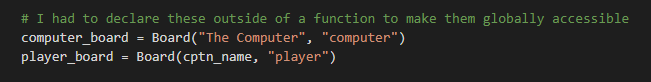
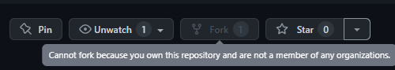

# Battleships
This game was made with python and runs in a terminal. 
The terminal used in this project is the Code Institute mock terminal on Heroku
The aim of the game is to hit the enemy ships before the enemy hits yours

[Link to deployed project](https://joes-battleships.herokuapp.com/)
 

## How to play
This game is based on the classic game called Battleships, a game that dates back to to world war one. you can see more information at this link on [Wikipedia](https://en.wikipedia.org/wiki/Battleship_(game)).

After the player enters their name there board is randomly populated with four ships, each ship is represented by the @ symbol. The enemies ships are hidden so the player will have to guess where they are.

Every turn the player will have to choose two locations between 0 - 3
After the player takes their turn the computer will take their turn and both scores and boards will be updated.
### The guide is as follows:
    Open sea: .
    Location of ally ship: @
    Location missed: X
    Enemy/Ally ship hit: *
 

To win you must sink all the enemy ships before they sink yours

## Features
### Existing Features
- Entering your Name
 
- Random ship locations
 
- Enemy ships are hidden
 
- Play against the computer
 
- Choose firing location
 
- Score area
 

#### Input validation
- You must guess a Number
 
- The Number must be between 0 - 3
 
- You cant guess the same location twice
 

### Future Features
- Allow for a player to play vs another player
- Choose your own ship locations
- Choose the size of the board

## Data Model
I had to use O.O.P. so i decided to use a class model
Each player has an instance that stores there:
- Their name
- Their guesses
 
- The locations of their ships
 

It also had methods to:
- Populate the board
 
- Print the board 
 
- Take a turn
 

## Testing
I tested using the following:
Passed the code through a PEP8 with two errors
I also added the incorrect inputs to test if the program would sucessfully atempt to resolve the error. 
These errors were:
- Strings were numbers could only be inputed
 
- Values outside the scope
 
- Targeting the same location more than once
  
I ran the code in my local terminal and the Code Institute Heroku terminal in chrome browser on my Windows PC, I also ran it on chrome browser on my Adroid mobile device and it worked without error.
### Bugs
Solved Bugs
- I had to declare the instances outside of a function to make them globally accessible
 

There are no known remaining Bugs
### Validator Testing
- PEP8
    * Passed the code through a PEP8 with two errors. These errors were that two lines were too long but I did not know how to shorten these lines
     

## Deployment 
This project was deployed using the Code Institute mock terminal on Heroku.
The steps for deployment are as follows:
- Fork or clone this repository
 
- Create a new Heroku app
 
- Set the buildbacks to Python and NodeJS in that order
 
- Link the Heroku app to the repository
 
- Click on Deploy
 
## Credits 
- Code Institute for the deployment terminal
- Wikipedia for the details of the Battleships game